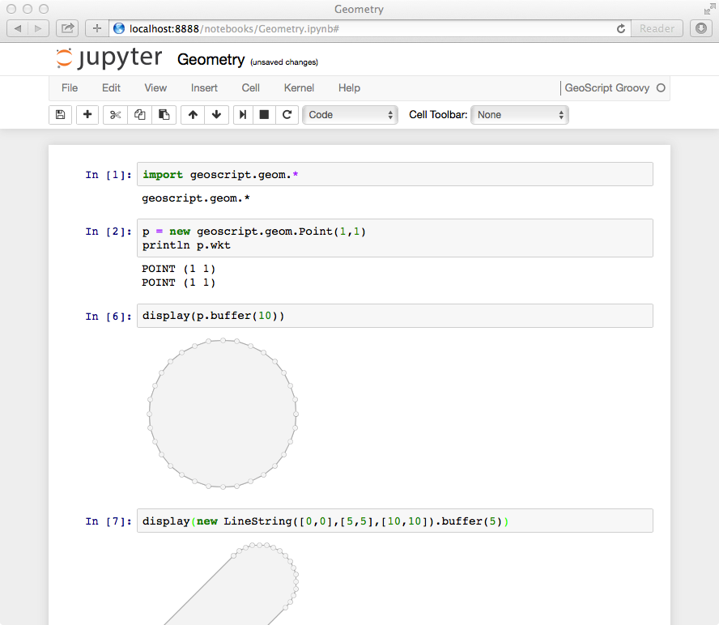

GeoScript Groovy Jupyter Kernel
===============================
This Jupyter Kernel for GeoScript Groovy is a simple `wrapper kernel <http://jupyter-client.readthedocs.org/en/latest/wrapperkernels.html>`_ that uses
the Python's `replwrap <http://pexpect.readthedocs.org/en/latest/api/replwrap.html>`_ module to connect to a GeoScript Groovy Shell.  This Kernel
requires `GeoScript Groovy <https://github.com/geoscript/geoscript-groovy>`_ to be installed and the geoscript-groovysh command to
be on the PATH.  To use, just change the kernel in your notebook to GeoScript Groovy.  Then you can use the notebook like you would use `groovysh <http://groovy-lang.org/groovysh.html>`_ from the command line.  A special display function can be used to display images, geometry, features, layers, or maps.

Install
-------
First, install jupyter

  pip install jupyter

Then clone the GeoScript Groovy Kernel repository

  git clone https://github.com/jericks/geoscript-groovy-kernel.git 

Install the kernel

  python geoscript_groovy_kernel/install.py

And start a Jupyter Notebook

  jupyter notebook
